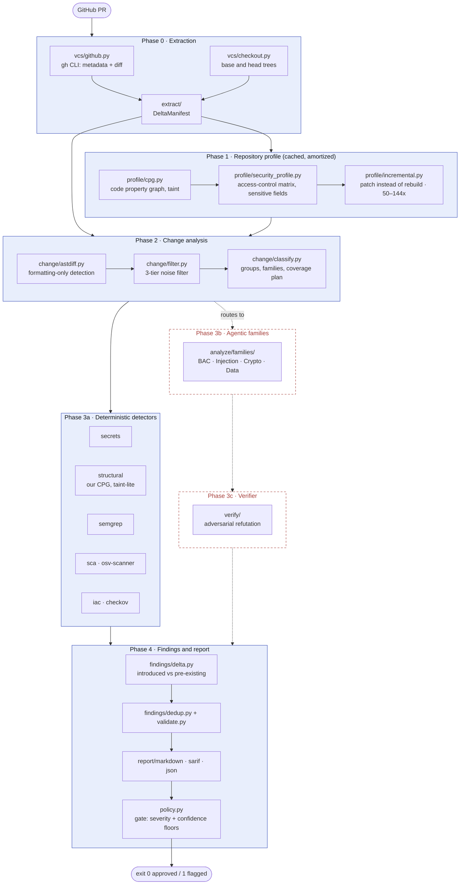

# pr-review

A security-focused pull-request reviewer for Python repositories. It builds a cached model of the
repository once, works out what a PR actually changed, runs deterministic detectors over the
changed surface, and gates the PR on findings it can attribute to the diff rather than to the code
that was already there.

**It is roughly one third of the tool it was designed to be, and the boundary is deliberate.** The
deterministic half is built and measured. The agentic half — where the design expects most of the
findings to come from — is designed, specified, and not built. What follows says which is which
before it says anything else, because a security tool that overstates its coverage is worse than
one that has none.

```bash
pr-review review https://github.com/owner/repo/pull/123
```

---

## Status

| | |
|---|---|
| **Built and measured** | Phases 0, 1, 2, 3a, 4 — extraction, repository profiling, change analysis, five deterministic detectors, finding pipeline, reporting, gate |
| **Designed, not built** | Phase 3b agentic families (Broken Access Control is the flagship), Phase 3c adversarial verifier, Phase 5 orchestration and registries — **3b's designed input has been measured even though 3b has not been built**: handed to a model, it did not improve review ([REPORT.md](REPORT.md) §3.4) |
| **Why** | 3b and 3c need a model provider. The AWS Bedrock credentials this was built against never arrived. See [Scope](#scope-what-is-designed-and-not-built). |
| **Tests** | 894 passing |
| **Milestones** | M0 ✅ · M1 ✅ · M2 ✅ · M3–M5 ❌ · M6 ~65% (the benchmark harness exists and has run) |

---

## Architecture



Solid boxes are built and exercised on real PRs. Dashed red boxes are designed and absent — the
seams they attach to exist (`DetectorKind.AGENT`, `models/provider.py`, `build_framework`, the
authored CAP assets in `pr_review/prompts/`), and `change/classify.py` already populates the
`candidate_families` and `coverage_plan` that Phase 3b would dispatch on.

**Phase 1 is the cost argument.** Profiling a repository is expensive and PR review is repeated, so
the profile is built once per repository and patched thereafter — measured at **50× cheaper on a
54-file repo and 144× on 304 files**, with a matrix identical to the full build. The ratio grows
with repository size, which is the shape the design needs.

---

## What it finds

Five detectors, all normalized into one `Finding` schema and scoped against a baseline run of the
same detectors on the base tree, so a finding is reported only if the PR introduced it:

| detector | what it is | needs |
|---|---|---|
| `secrets` | credential patterns, with a generic-entropy fallback | — (prefers `gitleaks`) |
| `structural` | our own code property graph: taint paths, endpoint/authz mismatches | `--head-dir` |
| `semgrep` | Semgrep `p/python`, baseline-aware | `semgrep` |
| `sca` | dependency advisories for packages the PR adds or changes | `osv-scanner` |
| `iac` | Terraform/Docker/K8s policy checks | `checkov` |

Plus a **prompt-injection sentinel** that scans the PR body, titles and diff *before* the noise
filter, since instructions aimed at a reviewing model would otherwise be filtered away as
uninteresting text.

---

## What it does not do

Stated plainly, because each of these is a thing a reader would reasonably assume:

- **It does not reason about your code.** Every finding above comes from a pattern, a graph
  traversal or an external scanner. The parts that were meant to *understand* a change — the
  agentic families and the verifier — are not built.
- **It does not post to GitHub.** No comments, no reviews, no SARIF upload. It reads a PR and
  writes files.
- **It has no HTML report for a single PR.** The only HTML it produces is the benchmark
  [comparison scorecard](#the-measurement).
- **It is not calibrated.** Confidence scores are assigned by rule, not fitted to outcomes.
- **Python only.** The profile, the CPG and the change analysis are Python-specific;
  `iac` and `secrets` are language-agnostic by accident, not by design.

---

## The measurement

Three pinned corpora, 43 stored runs, every number re-derivable from a committed `run.json`.
Details and the reasoning behind each figure are in [`BENCHMARK_STATUS.md`](BENCHMARK_STATUS.md).

**Against a raw LLM.** The corpus is a **post-cutoff temporal holdout** — every advisory in it was
published after the baseline model's training cutoff — which is the usual fatal objection to a
comparison like this one, and it holds here by accident.

| arm | recall | recall, reachable stratum | FP per control PR | cost |
|---|---|---|---|---|
| semgrep alone | 0.000 (0/36) | 0.000 (0/9) | 0.00 | $0 |
| **this pipeline** | 0.028 (1/36) | 0.111 (1/9) | 0.04 | $0 |
| raw LLM on the diff, ×3 | 0.500 · 0.500 · 0.472 | 0.556 · 0.667 · 0.556 | 0.12 · 0.19 · 0.15 | $0.014/case |
| **LLM fed the pipeline's context, ×3** | **0.417 · 0.556 · 0.417** | 0.556 · 0.556 · 0.556 | 0.15 · 0.08 · 0.04 | $0.026/case |

**Read those against the ceiling: 27 of the 36 ground-truth rows name weaknesses no detector here
can express, so a perfect version of this pipeline scores 0.250, not 1.000.** That is why the
second column exists. The honest summary is that on the ground truth this pipeline was built to
express, a diff-only LLM finds **five times** as much — which prices what the unbuilt agent layer
would have to earn, and is the most useful thing this repository currently knows.

On 50 merged PRs from healthy repositories it reports **0.24 false positives per PR** and **0.02
gate-relevant**, which is the number the deterministic half is actually good at. Most of that is one
stage: scanning the base commit and subtracting what was already there removes **86% of the raw
findings** (97% on the labelled corpus), taking the false-alarm rate from 1.74/PR to 0.24. A
reviewer that only sees the diff has no equivalent mechanism — but it turns out not to need one:
asked for introduced-only findings, the LLM baseline reported **0–1** false alarms across 26 control
PRs over three passes, against the baseline prompt's 3–5. The pipeline's version is mechanical, costs
nothing, and names the base-commit finding it matched; it is not, however, a capability only a
base-tree scan can buy — and it is not, as this section claimed until 2026-08-24, bought at the cost
of the model's recall. That trade was a single draw and did not replicate (§14.51).

The [comparison scorecard](benchmark/results/comparison.html) renders all of this as one page, and
`REPORT.md` renders as its companion:

```bash
./benchmark/results/comparison.sh              # the scorecard, from the stored runs
.venv/bin/python render_report.py REPORT.md /tmp/report.html   # the report page
```

Both are published as private artifacts and updated **in place**; the URLs are recorded in the
project's assistant memory rather than here, because a URL in a source file goes stale silently.

Each generator records what it built from in `benchmark/results/.rendered.json` and **reports when a
source has moved since** — so an edit to `REPORT.md` that never reached the published page says so
the next time either page is rendered. It reports; it does not fail. An unpublished edit is the
normal state of the tree between a fix and its landing, and a check that goes red there is a check
people learn to ignore (`OPEN_ITEMS.md` §24).

---

## Running it

```bash
python -m venv .venv && .venv/bin/pip install -e '.[dev,tree-sitter]'
brew install gh                         # metadata and diffs come through the gh CLI
gh auth login                           # or export GH_TOKEN
```

Optional external scanners — each degrades to `missing_tool` and says so in the report rather than
failing the run:

```bash
brew install semgrep osv-scanner gitleaks
pipx install checkov
```

Then:

```bash
# a real PR: fetches metadata, materializes both trees, profiles, detects, gates
pr-review review owner/repo#123

# offline, from a diff on disk
pr-review review --repo owner/repo --pr 123 --diff-file changes.diff

# build or rebuild a repository profile on its own
pr-review profile /path/to/checkout --repo owner/repo --sha <base_sha>
```

Exit codes: **0** approved · **1** flagged · **2** tool or usage error.

Configuration is [`pr_review.yaml`](pr_review.yaml); every key is optional and mirrors a built-in
default. The gate's floors (`severity_floor: high`, `confidence_floor: 6`) are the two most likely
to want changing.

**The benchmark harness** is a separate entry point:

```bash
.venv/bin/python -m pr_review.benchmark run --corpus benchmark/corpus/labelled.json \
    --cold-profiles --label my-run
.venv/bin/python -m pr_review.benchmark gate --run <new>/run.json --baseline <old>/run.json
```

---

## Scope: what is designed and not built

The design is [`PR_Rev_0620.md`](PR_Rev_0620.md) plus nine documents in [`plan/`](plan/), and it
specifies a seven-milestone tool. Milestones M3, M4 and M5 are not built, and will not be built
from this branch.

**The reason is one dependency.** M3's agentic families, M4's adversarial verifier and M5's
recursive language model all require a model provider, and this project was built against AWS
Bedrock credentials that never arrived. `models/bedrock.py` was deliberately never written blind
(`M1_STATUS.md` §5.3): a provider that has never spoken to its service is a guess with tests.

What *was* done instead is a smaller and more useful thing: [`models/claude_cli.py`](pr_review/models/claude_cli.py)
fills the same `ModelProvider` seam over the `claude` CLI, which proved the seam is real and made
the comparison above possible. It does **not** discharge the Bedrock work, and it deliberately does
not implement CAP's `InferenceProvider` — flattening that interface's `system_prompt_parts` would
destroy the prompt-cache breakpoints the whole token-economy argument rests on.

**Everything M3 dispatches on already exists**, which is what makes it a resumable milestone rather
than a rewrite:

| seam | where |
|---|---|
| `DetectorKind.AGENT` | `pr_review/schema.py` |
| `ModelProvider` | `pr_review/models/provider.py` (`fake.py`, `claude_cli.py` behind it) |
| CAP framework wiring | `pr_review/models/framework.py` — `PRFramework`, `build_framework` |
| authored agent assets | `pr_review/prompts/` — personas, tasks, workflows, templates |
| the input agents consume | `change/classify.py` → `candidate_families`, `coverage_plan` |
| tool permissions | `pr_review/safety/permissions.py` — planners never read source |

`analyze/` is absent because building it *is* M3.

Three known defects sit in the flagship BAC agent's input and should be read before it is built
rather than discovered by it: they are listed in [`CONTINUATION.md`](CONTINUATION.md) §4.

---

## Where to start reading

| document | what it is for |
|---|---|
| [`REPORT.md`](REPORT.md) | **the writeup** — what the comparison asked, found, and got wrong |
| [`CONTINUATION.md`](CONTINUATION.md) | where the work stands and how to run things |
| [`OPEN_ITEMS.md`](OPEN_ITEMS.md) | problems found and deliberately not fixed, with the reasoning |
| [`PR_Rev_0620.md`](PR_Rev_0620.md) | the locked design outline — and **§14, 45 errata** entries recording where building it proved the design wrong |
| [`plan/`](plan/) | design intent, one document per phase |
| [`M1_STATUS.md`](M1_STATUS.md) · [`M2_STATUS.md`](M2_STATUS.md) | build records for the profiling/change and detector milestones |
| [`BENCHMARK_STATUS.md`](BENCHMARK_STATUS.md) | every measurement, every corpus, and every defect measuring found |
| [`PIVOT_PLAN.md`](PIVOT_PLAN.md) | why the remaining milestones were cut, and what was built instead |

**§14 of `PR_Rev_0620.md` is the most useful document here** if you intend to continue the work. It
is not a changelog; it is 45 entries on places where the design, a measurement, or a previous entry
turned out to be wrong, each with what was actually true and what was done about it. Several of the
most expensive mistakes in this repository were found by a *second* way of deriving a number
disagreeing with the first.

---

## Repository layout

```
pr_review/          the tool
  extract/          Phase 0 — diff parsing, dependency changes, DeltaManifest
  profile/          Phase 1 — CPG, security profile, incremental patching, cache
  change/           Phase 2 — AST diff, 3-tier noise filter, grouping
  detect/           Phase 3a — five detectors and a normalization spine
  findings/         Phase 4 — validate, dedup, baseline/delta scoping
  report/           markdown, SARIF
  safety/           injection sentinel, tool permissions, wrapping
  models/           the provider seam, CAP wiring, the claude-CLI provider
  benchmark/        the measurement harness (M6, pulled forward)
  taxonomy/         internal ids ↔ CWE / OWASP
benchmark/
  corpus/           three pinned corpora, by repo + PR + both shas
  results/          43 stored runs, each with its scorecard and run.json
  prompts/          the LLM-baseline prompt, as a committed artifact
cap_engine/         SEPARATE REPOSITORY, restricted licence, gitignored, never edited
tests/              894 tests
```

> **`cap_engine/` is not part of this repository.** It is a separate project under a restricted
> licence, present on disk and excluded from version control. It is never edited; every
> integration is an override in `pr_review/models/framework.py` or a shim in
> `pr_review/cap_compat.py`, so it can be re-synced or replaced without conflicts.
