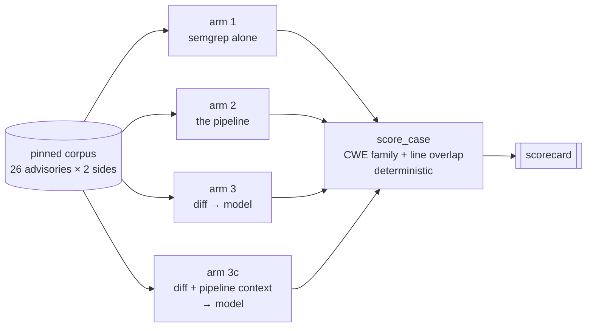

# Context-fed Model Preliminary Justification Report

**A report on the five-arm comparison.**
Companion documents: [`README.md`](README.md) for what the tool is, [`BENCHMARK_STATUS.md`](BENCHMARK_STATUS.md) §4i for the measurement record, [`PR_Rev_0620.md`](PR_Rev_0620.md) §14 for the errata this produced. The scorecard is [`benchmark/results/comparison.html`](benchmark/results/comparison.html).

---

## 1. The question

This project set out to build a security-focused PR reviewer on a premise: that a *pipeline* — a
cached repository model, careful change analysis, deterministic detectors, and only then agents
aimed at what survives — would review better and cheaper than sending a diff to a model and reading
the answer.

Due to time constraints, three of the seven milestones could not be built: The agentic families (M3),
the adversarial verifier (M4) and the orchestration layer (M5).
What remains is the deterministic half: extraction, profiling, change
analysis, detectors, and the finding pipeline that scopes them against a baseline.

That leaves the project's central premise, that the pipeline earns its complexity, untested.
Complexity that is two thirds unbuilt cannot be
defended by describing what the missing third would have done. So the question became narrower and
answerable:

> The pipeline costs **N** tokens and finds **X**. A model reading the same diff costs **M** and
> finds **Y**. The gap `Y − X` at price `M − N` is **the budget the agent layer would have to
> earn**.

---

## 2. Design

### 2.1 Five arms, one scorer

| arm | producer | corpus |
|---|---|---|
| **1** | semgrep alone, every other detector disabled | labelled |
| **2** | the pipeline, deterministic | labelled |
| **2b** | the pipeline with live tier-3 triage | negative |
| **3** | a model given the diff and nothing else — Sonnet, `--effort low`, three passes | labelled + negative |
| **3c** | the same model given the diff **and the pipeline's context bundles**, three passes | labelled + negative |

Every arm emits `Finding`-shaped output and is scored by the same `score_case`: CWE-family match
plus line overlap, deterministic, no model judging any output. Arm 3 is a 300-line *producer*, not
a second harness, which makes it affordable.

**Arm 3's input is a strict subset of arm 3c's**, and that is asserted rather than intended: a test
requires arm 3c's message to *begin with the exact bytes arm 3 would have sent*, and a second
requires the two prompts' output contracts to be word-for-word identical. So a difference between
them is attributable to the added context and to nothing else — which is the only reason the pair
means anything.

**Arm 3 is blind and tool-free.** It sees `pr_task.diff_text` and nothing else: no ground truth, no
advisory summary, no pipeline output. `AdvisoryRef.summary` is deliberately withheld from the task
so it cannot leak its own answer. The model runs with `--disallowedTools` *and* from a
`tempfile.mkdtemp()` working directory, because a model that can read the checkout has silently
become a different experiment — and `assert_no_tool_use()` checks the CLI's own turn count
afterwards. Belt and braces, because that failure is invisible in the output.

**It is a subprocess, not this session.** Both live arms run through `claude -p` with a committed
prompt file, so a third party can re-run them. An agent spawned from a working session inherits its
framing and cannot be reproduced.

The following was used as a baseline for the prompts in all arms involving the LLM:
"You are a security reviewer examining a single pull request diff.
Report only vulnerabilities that this diff introduces or leaves present in the
code shown."
3b dropped the "or leaves present" and 3c recieved an additional description of the context section and an instruction to more strongly delineate potential reference vulnerabilities from the PR's.

---

## 3. Results

All figures rescored by the current rules from stored runs. Rates carry their denominators.

| arm | recall (36 rows) | recall ignoring CWE | reachable stratum (9) | precision | FP / control PR | cost |
|---|---|---|---|---|---|---|
| 1 semgrep alone | 0.000 (0/36) | 0.000 (0/36) | 0.000 (0/9) | n/a | 0.00 | $0 |
| 2 pipeline | 0.028 (1/36) | 0.028 (1/36) | 0.111 (1/9) | 0.500 (1/2) | 0.04 | $0 |
| 3 LLM, pass 1 | 0.500 (18/36) | 0.806 (29/36) | 0.556 (5/9) | 0.531 (26/49) | 0.12 | $2.5611 |
| 3 LLM, pass 2 | 0.500 (18/36) | 0.750 (27/36) | 0.667 (6/9) | 0.523 (23/44) | 0.19 | $0.7716 |
| 3 LLM, pass 3 | 0.472 (17/36) | 0.778 (28/36) | 0.556 (5/9) | 0.488 (21/43) | 0.15 | $0.7231 |
| **3c context, pass 1** | **0.417 (15/36)** | 0.750 (27/36) | 0.556 (5/9) | 0.439 (18/41) | 0.15 | $1.7376 |
| **3c context, pass 2** | **0.556 (20/36)** | 0.778 (28/36) | 0.556 (5/9) | 0.578 (26/45) | 0.08 | $1.2896 |
| **3c context, pass 3** | **0.417 (15/36)** | 0.667 (24/36) | 0.556 (5/9) | 0.486 (18/37) | 0.04 | $1.1232 |

**Recall ignoring CWE** is the second column's question with the taxonomy left out: did any finding
point at the vulnerable lines, whatever it called them. The pipeline's two recalls are identical by
construction — a detector emits a fixed id — while a model that names CWEs freely shows a gap of
9–12 rows. That gap is a property of the arm's vocabulary, not recall it deserves credit for.

### 3.1 Read every recall figure against its ceiling

**27 of the 36 ground-truth rows name weaknesses no detector in this milestone can express.** The
pipeline's emittable CWE set is the union of the taxonomy registry's lists; `CWE-400`, `CWE-1333`,
`CWE-834`, `CWE-200`, `CWE-59`, `CWE-61`, `CWE-455` and others are outside it. Resource exhaustion,
ReDoS, symlink handling, information exposure. **A perfect version of this pipeline scores 0.250 on
this corpus, not 1.000.**

That is why the reachable-stratum column exists, and it is the only honest place to compare the two
kinds of arm — the model answers in CWE directly and is not confined to the taxonomy at all.

### 3.2 The predictions

| | prediction | outcome |
|---|---|---|
| P1 | arm 3 out-recalls the pipeline | ✅ by **13×** overall, **5×** on the reachable stratum |
| P2 | arm 3's false positives *much* higher, mostly on controls | ❌ **wrong** |
| P3 | arm 3 varies run to run | ✅ recall 0.500/0.500/0.472, FP 3/5/4, pairs 9/11/10 |
| P4 | most of arm 3's hits land on unreachable ground truth | ⚠️ **split** |

**P2 is an informative failure.** The reasoning was that a model with no baseline cannot tell an
introduced vulnerability from a pre-existing one — it never sees the base tree — so a post-fix
control should look identical to its vulnerable twin apart from the fix, and the model should fire
on both. It does not. (That reasoning also had a hole nobody spotted at the time: the prompt
*instructed* the model to report pre-existing findings, so the prediction and the instruction were
pulling in opposite directions. Errata §14.47.) 3–5 false positives per 26 control PRs against the pipeline's 1 is 3–5×, not
the order of magnitude implied by "much higher". And pair discrimination came out **0.35–0.42
against the pipeline's 0.04**: the model is not merely finding more, it is separating the vulnerable
side from its own fix roughly ten times more often. The expected failure mode of the naive baseline
did not materialise, and the argument for the unbuilt Phase-3c verifier is correspondingly weaker
than it was pre-registered to be.

**P4 half-held.** 8–10 of each pass's true positives are on CWEs the pipeline has no word for, as
predicted. But the arms were predicted to converge on the reachable stratum and they do not:
**0.556–0.667 against 0.111**, still five times. The gap is not an artifact of vocabulary.

### 3.3 Variance

The scorecard reports a spread, rather than a mean.
In arm 3, recall spans 0.028, reachable recall 0.111, pair discrimination 0.077 across three
passes at `--effort low`. Arm 3b varies more, not less: control-half output 0 · 0 · 1, headline
recall spanning 0.138 and the reachable stratum 0.334 — a third of the axis, on a denominator of 9.
That is a product difference — a reviewer whose answer changes between runs is a different tool from
one whose answer does not — and averaging it away would hide the finding rather than summarize it.

Arm 3's recall spans 17–18 of 36 across three passes. **Arm 3c spans 15–20.** Its best pass beats
every arm-3 pass and its worst loses to every arm-3 pass.
**So a single pass of this arm could have been written up honestly as either a win or a loss**, and
the choice would have been made by whichever pass ran. See §14.51.

### 3.4 The context arm: what feeding the pipeline's own payload to a model actually bought

This is the question the whole document exists to answer, and the answer is a null.

#### 3.4.1 On the labelled corpus, nothing

| | recall | recall ignoring CWE | precision |
|---|---|---|---|
| **arm 3** — diff only | 18 · 18 · 17 of 36 | 29 · 27 · 28 | 0.53 · 0.52 · 0.49 |
| **arm 3c** — diff + context | 15 · 20 · 15 | 27 · 28 · 24 | 0.44 · 0.58 · 0.49 |
| | **mean 17.7 → 16.7** | **28.0 → 26.3** | **0.51 → 0.50** |

Not a small gain, not a small loss: **no detectable difference, in either direction, on any measure,
with wider variance.**

#### 3.4.2 The test built to attribute an improvement, which found none to attribute

The bundles do not cover every ground-truth row. Measured before the arm ran: **26 of the 36 rows
have source in the context that covers the vulnerable lines; 10 do not.** On those 10, arm 3c
receives nothing arm 3 did not, beyond framing. So the pre-registered inference was:

> If the arm improves on the 26 and not the 10, the improvement is attributable to context. If it
> improves equally on both, the improvement is prompt framing, not context.

| | 26 rows **with** source | 10 rows **without** |
|---|---|---|
| arm 3 | 12.0 | 5.7 |
| arm 3c | **12.3** | **4.3** |

**+0.3 where context could help; −1.4 where it could not.** Both inside per-pass noise. The
discriminator was built, it was run, and there was no improvement to discriminate.

#### 3.4.3 And yet the context demonstrably works — just not in a direction that scores

On 50 merged PRs from healthy repositories, where every finding counts against the tool:

| | false alarms | gate-relevant | `BAC-MISSING-AUTHZ` |
|---|---|---|---|
| arm 3 | 3 · 4 · 3 (mean 3.3) | 0 · 0 · 0 | **0 · 0 · 0** |
| arm 3c | **2 · 8 · 5 (mean 5.0)** | 1 · 2 · 1 | **2 · 2 · 1** |
| the pipeline | 12 | 1 | 11 |

False alarms went **up**. But look at the third column. **Arm 3c produces five missing-authorization
findings across three passes and arm 3 produces none**, with titles in the pipeline's own vocabulary
— *"New page action endpoints bypass require_any_permission decorator"*, *"publish endpoint creates a
revision before permission check"*. That is `ProfileSlice.access_control_rows` reaching the model's
output. Arm 3 also finds **zero** gate-relevant issues on this corpus; arm 3c finds them at the
pipeline's own rate.

**So the context is not inert. It redirects the model's attention exactly where its designers aimed
it.** On a corpus of clean pull requests, looking harder at authorization produces false alarms. On a
corpus of known vulnerabilities, it did not produce more true ones. **The context made the model
different, not better** — and that sentence is the honest headline of this report.

#### 3.4.4 Every prediction, scored

| | prediction | outcome |
|---|---|---|
| P1 | no headline recall win | **HELD** — 16.7 against 17.7 |
| P2 | precision > 0.55 *(restated in a dated addendum before any result existed)* | **FAILED** — 0.50 against 0.51 |
| P3 | control-half false alarms fall to 0–2 of 26 | **HELD** — mean **4.0 → 2.3** |
| P4 | "reached the right file" rises above 30/44 | **FAILED** — flat |
| P5 | improvement concentrates on the 26 covered rows | **NULL** — none to concentrate |
| P6 | dilution failure mode: recall < 10 or findings < 30 | **did not trigger** |
| P7 | payload near 1.5× on ordinary PRs | **HELD** — 1.39× |
| P8 | false alarms fall on ordinary PRs | **FAILED, opposite direction** |
| P9 | gate-relevant stays at or above 0.02 | **HELD for 3c**, failed for arm 3 |

---

## 4. Cost

Arm 3 costs **$2.56 for the first pass and ~$0.75 for each subsequent one** — the difference is attributable to the
prompt cache, not the work changing.

Two levers dominate, and both were found by measuring rather than by reading documentation:

**Effort is larger than the prompt.** One call on a 9.2 KB diff:

| | output tokens | of which thinking | wall | cost |
|---|---|---|---|---|
| CLI default | 9,399 | 9,033 | 78s | $0.149 |
| `--effort medium` | 646 | 342 | 8s | $0.087 |
| `--effort low` | 245 | 0 | 5s | $0.081 |

**96% of a default call's output is extended thinking, billed at the output rate.** A benchmark arm
that does not state its effort level has not described what it measured; `plan/benchmark.md` §3 asks
for "a raw single-prompt LLM", and a default-effort call is a reasoning loop — a defensible baseline
but a different one.

**The harness is a tax.** The `claude` CLI prepends its own system prompt, measured at ~7,300 tokens
per call even with `--system-prompt` and `--exclude-dynamic-system-prompt-sections`. Across arm 3
that is roughly 380k tokens of harness riding along with 250k tokens of content. None of these
figures is an API price.

**Context costs a different multiple on each corpus, and publishing one number would be wrong.**
Measured on the built producer, not estimated from bundle sizes:

| | payload vs the raw diff | population |
|---|---|---|
| labelled corpus | **3.41×** | 52 advisory-derived cases, median diff 8.3 KB |
| negative corpus | **1.39×** | 48 ordinary merged PRs, median diff 7.9 KB |

The same context assembler, the same renderer, a 2.5× difference in what it costs — because an
advisory-derived PR is small and *entirely* relevant, so the bundles duplicate little of it, while an
ordinary PR is large and mostly irrelevant, so the bundles replace far more than they add. **Quoting
either figure without its corpus is the error §14.56 records**, where exactly this ratio was carried
outside the set it was measured on and had to be struck the same day.

**The arm carries the diff *and* the context, so it is dearer than arm 3 by construction, everywhere.** The only cheaper rung —
bundles instead of the diff, measured at 0.50× — was priced and deliberately not run, because a model
given bundles alone never sees a removed line, and removing a guard is a primary way a pull request
introduces a vulnerability.

**The pipeline's own token cost is small.** Arm 2b ran tier-3 triage
live over 50 merged PRs: 33 of them reached the tier at all, one Haiku call each, **$0.9537 total,
$0.019 per PR**. That is the first real number for a project whose standing caveat had been "cost
is unmeasured, not low".

---

## 5. Conclusion

### 5.1 What the comparison answers

The document opened with a budget: a model reading the diff finds **eighteen times** what this
pipeline finds on the ground truth the pipeline can express (18/36 against 1/36), at `--effort low`
and $0.014 a case. That is what the unbuilt agent layer would have to earn.

**The first attempt to earn it did not.** Arm 3c is not a proxy for that layer — it is the layer's
specified *input*, `ContextBundle`, captured and handed to the same model beside the same diff.
Recall **15–20 of 36 against arm 3's 17–18**; precision **0.50 against 0.51**; wider variance on
every measure. Three passes each, one scorer, one corpus, and arm 3's input a strict subset of arm
3c's.

**The premise was that assembled context makes a reviewer better. The first direct test of it says
it does not** — and any future version of the argument has to start there rather than from the
design document.

What the context *did* buy is legible and small. It made the model report missing authorization
where it otherwise reported nothing, in the pipeline's own vocabulary. On clean pull requests that
read as false alarms; on the fixed half of a labelled pair it correctly *suppressed* findings,
cutting false alarms from 4.0 to 2.3. **Context changed what the model attended to. It did not
change how well it reviewed.**

### 5.2 A split verdict

Averaging the result into "context did not help" hides that **the payload was two different things
in one message**, and the evidence separates them.

Measured over the labelled corpus, what arm 3c actually sent was:

| part of the message | share | what it is |
|---|---|---|
| the diff | 30% | identical to arm 3 |
| **source excerpts** | **49%** | enclosing symbols and one-hop neighbours — *code near the diff* |
| **the profile slice** | **~12%** | the analytical output: taint nodes, sanitizers, access-control rows |
| structure and headers | ~9% | group outlines, fences |

**The source half was tested fairly and did nothing.** On the 26 ground-truth rows where the context
did contain source covering the vulnerable lines, arm 3c matched **12.3** against arm 3's **12.0**.
Where the pipeline delivered exactly what it was supposed to, the model was no better for it.

**The analytical half was largely never delivered.** `auth_summary` reads *"authn: not established"*
in **512 of 512 bundles** — every bundle on both corpora. `access_control_rows` are present in **5%**
of labelled bundles and 4% of negative ones; reachability hints in 9% and 0%; sanitizers in 25% and
9%. Phase 1 established almost nothing to pass on.

**And where it was delivered, it worked.** Arm 3c produced five `BAC-MISSING-AUTHZ` findings that arm
3 never produced. **All five landed on the one negative-corpus case whose bundles actually carried
`access_control_rows`**, and it fired there in all three passes. The rarest populated field produced
the only reproducible behavioural change in the experiment.

> **So the honest verdict is split.** *More context near the diff* was measured and did not help.
> *The pipeline's analysis* was mostly absent from the payload, and the one time it was present it
> changed the answer. n=1 on the second half, and on a clean PR the change was a false alarm — but it
> is the difference between "this idea failed" and "this idea was largely untested by the run
> intended to test it".

### 5.3 Why the null is a floor and not a verdict

Four limits, all measured before the arm ran, all pointing the same way:

1. **Arm 3 already sees every ground-truth line.** All 112 spans sit inside a hunk, so context could
   never win on *visibility* — only on judgment about lines the model could already read. **A
   `reverse_fix` corpus cannot contain the case where context matters most**, because reverting a fix
   makes the vulnerable lines *be* the diff. A real pull request's vulnerable sink is often
   pre-existing and outside it. This corpus asked the arm its hardest question, not its fairest.
2. **Only 26 of 36 ground-truth rows have source in the context at all**, and 34 of 175 bundles carry
   no source whatsoever.
3. **The pipeline's own routing plan was not honoured.** `build_bundles` marks 113 of 175 bundles
   `full_file` — its judgment that the surrounding logic decides safety — and the arm sent slices,
   because the capture holds slices.
4. **Neighbour selection was never measured.** Six neighbours, chosen by source order, when the graph
   already knows which ones sit on a taint path.

Add §5.2's finding to that list and the summary is: **the cheapest, least-informed configuration of
this idea, carrying an analytical payload that was mostly empty, did not pay off on the corpus least
able to reward it.** That is worth knowing, and it cost $23.16 to learn. It is not "context does not
help".

### 5.4 What this says about the milestones that were never built

**M3, the agentic families.** Arm 3c priced M3's *input* and found it inert as delivered. It says
nothing about M3's *loop* — an agent that asks follow-up questions, honours the escalation tier, and
re-queries the graph. §5.2 sharpens rather than softens this: the input was inert partly because
Phase 1 had little to put in it, and an agent that could *ask* would not be limited to what the
bundle happened to contain. **The burden has moved, though.** M3's case can no longer rest on "the
context will make a model better", because that specific claim was tested. It now has to rest on the
loop, and that is a harder and more interesting argument.

**M4, the adversarial verifier.** Weakened for an unrelated reason, in §3.2. Its case rested on a
naive baseline firing on everything, and the pre-registered prediction that arm 3 would do so
**failed** — the model separated a vulnerable half from its own fix roughly ten times more often than
the pipeline did. A verifier that exists to clean up after a sloppy generator needs the generator to
be sloppy.

**M5, orchestration and the RLM.** Untouched by any of this. It was cut for the same missing
credentials and nothing measured here bears on it.

**The deterministic half remains a real floor**, and it is the part that shipped: 0.24 false
positives per PR across 50 merged PRs, 0.02 gate-relevant, free, and byte-for-byte reproducible. Its
largest single effect is delta scoping — the base-commit scan removes **86% of raw findings on the
negative corpus and 97% on the labelled one**, taking false alarms from 1.74/PR to 0.24. Arm 3b then
showed that one changed instruction gets a diff-only model to the same place, so this is a real
capability and **not** one only a base-tree scan can buy (§14.47, §14.51).

### 5.5 Where the cost argument actually lives, and it is not here

**"Cheaper" was never available in this comparison, and its absence is an artifact of the arms, not a
property of the idea.**

Every arm here is single-shot and tool-free. That was a fairness decision: arm 4 — a model with
repository access — was cut precisely so the LLM could not read the source, and both LLM arms run
from a neutral working directory with tools disallowed. Under that constraint arm 3c can only *add*
tokens to arm 3's diff. It is dearer by construction, 3.41× on the labelled corpus and 1.39× on
ordinary PRs, and no configuration that retains the diff can be otherwise.

**A deployed reviewer would not be tool-free**, and that changes the cost model rather than adjusting
it. A tool-using model pays for **search**: multiple turns, each re-sending the accumulated
conversation, to discover what the pipeline already computed. The pipeline computes its profile and
graph **once per repository** and updates them incrementally — measured at 50–144× on re-runs. So the
pipeline's cost is amortised across pull requests while a searching model's is paid per pull request,
every time, and none of that is visible in a one-shot comparison.

Two measurements here already point at it, neither of which was collected for the purpose:

- **Two of fifty ordinary pull requests exceed any context window** — one is 4.37 MB. Both LLM arms
  refuse them; the pipeline reviews both, because it works file by file and never assembles one
  payload. A tool-using model would have to page through them, paying per page.
- **On ordinary PRs the assembled context is 0.39× the diff.** The bundles are *smaller* than the
  thing they describe, because an ordinary PR is large and mostly irrelevant. A bundles-only arm was
  measured at **0.50× arm 3's payload** and deliberately not run.

**The experiment that would settle it** is arm 3 with tools against arm 3c with tools, on repositories
large enough that exploration is not free — the question being whether pre-computed context reduces
the *search* rather than whether it improves the *answer*. That is the deployment question, and it is
the one where cost is live.

**Should the context-fed arm get tools as well?** I think yes, and that the pair is only interesting
if both do. A tool-free arm against a tool-using one measures tool access, which is arm 4 under
another name and was already cut for being uninterpretable. Giving both tools holds capability fixed
and varies exactly one thing — whether the model starts with the pipeline's answers or has to go and
find them. It is also markedly harder to run: tool use is nondeterministic in a way single-shot
prompting is not, per-case cost would vary by an order of magnitude rather than a factor, and this
project's own §3.3 already shows three passes is the *minimum* for separating a result from variance
at fixed scope. Budget for more passes, not fewer.

**None of that is measured, and this section is a projection rather than a result.** It is here
because the cost half of the original question — *processing might improve findings, reduce cost, or
both* — has been answered only in the configuration least able to show it.

### 5.6 Limits of the comparison as a whole

Four, all load-bearing:

1. **The pipeline's entire numerator is one finding.** Nothing here has the resolution to rank two
   tools that both score near zero, and a ratio between arms at n=1 is not a ratio between
   capabilities.
2. **A labelled case is a fixing commit run backwards**, so the vulnerable lines are essentially the
   whole diff — the easiest possible presentation of a defect, and one that favours a reader of
   diffs. The paired post-fix control is what keeps this from being worthless.
3. **The pipeline was measured at the scope it has, not the one it was designed for.** The design's
   own answer to this comparison is precisely the part that does not exist.
4. **The false-positive figures are upper bounds.** A merged PR from a healthy repository can still
   contain a real vulnerability nobody has found, and any such finding is counted against the tool.

And one that is not a limit of the experiment but of the reading: **26 advisories is a sample, not a
population.** Every number here should be quoted with its denominator, which is why every rate in
this repository refuses to render without one.

**The comparison is the deliverable that survived the pivot.** Three milestones were cut; what
replaced them is a measurement the finished tool would have needed anyway, taken while the question
was still open and in the direction least flattering to the thing being measured — which is the only
direction that makes a benchmark worth quoting.
